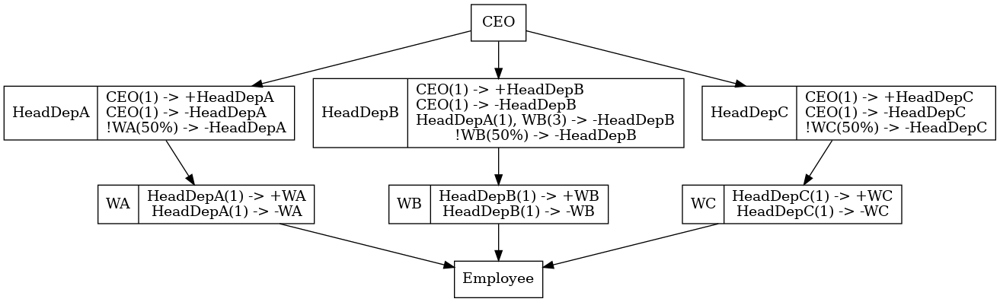

```
                   ┌¯\     ┌\
                   |░ \   ┌┘ \
                   |░░ \------┐
                    ┐░░     ~ └┐
                    |       ▀  |---▄        ____ ___  ____   ____ ___
                    └---    _      |       / ___/ _ \|  _ \ / ___|_ _|
   /|                └---  /      /       | |  | | | | |_) | |  _ | |
  |░|                └--   \-----/        | |__| |_| |  _ <| |_| || |
  |░░\----           |     ░░░|            \____\___/|_| \_\\____|___|
  |      ¯¯¯¯\------/    ░░░░░|
  └\                    ░░░░░░-┐                Version: 1.0.0 (Pembroke)
   |                     ░░░░░░-┐      Copyright © 2024, ABC Research GmbH
   |                     \ ░░░░░|
   └┐   /                 |░░░░-┘
    |  /        /---┐    /░░░░-┘
   ┌┘ /----┘¯¯¯¯    \-|-|-----┘
   |░└-┐   \░└-┐      |░└-┐└-┐
   └---┘   └---┘      └---┘--┘

(Wo)man's best friend for creating OrgCharts
CORGI stands for "Create ORG-chart (I don't know what the 'i' stands for)"
```

> **(Wo)man's best friend for creating OrgCharts**
>
> Version **`pembroke`**

`Corgi` (<u>C</u>reate <u>ORG</u>-chart; <u>I</u> don't know what the "I" is for) is a
Smart Contract Generator for Solidity that, given a definition file, produces
so-called _OrgCharts_ (i.e., organizational charts) that can be used to embed advanced role-based access control into your smart contracts.

The repository is structured in the following parts:

- `codegen`: This directory contains the actual code generator written in TypeScript.
- `orgchart`: This directory contains the Solidity code of the OrgChart (abstract) contracts
- `docs`: Containing some documentation files.

You can find an introductory example [here](#corgi-by-example). For a more detailed insight into key concepts, have a look [here](/docs/CORE.md).

> _**No Warranty Disclaimer:** `Corgi` is an experimental library and provided without warranty. Use it at your own risk.
> The authors are not liable for any damages resulting from using the generated code. Please test
> thoroughly before deploying to production (see [here](docs/TESTING.md)). By
> using `Corgi` you agree on this terms._

## The Concept in a Nutshell

The main problem that we are trying to solve with `Corgi` is the centralization and inflexibility of role-based access control (RBAC) in Solidity smart contracts. Roles can help to protect access to certain smart contract functions, which can be quite useful in many situations. An administrator can assign these roles to users that are trustworthy enough to receive the corresponding privileges. However, this is conceptually a very centralized approach, as a single person (the administrator) can decide about permissions on his or her own.

Instead, we want to provide a more flexible and decentralized approach, where the assignment of users to roles may be a joint decision by multiple users. Our own domain-specific language allows us to define expressive rules that specify how roles can be granted and revoked. To allow for maximum flexibility, these rules may be different for each role. For instance, we could specify that we need approval of three users with a manager role to grant an admin role to a user. In addition, we also support role inheritance, which helps to reduce redundancy.

You can find additional background information on our approach in our academic paper: https://ieeexplore.ieee.org/abstract/document/9909116 (we can also send it to you on-demand if you don't have access)

Please note that the implementation approach described in that paper is outdated, as it caused rather high gas consumption. In the released prototype version, we have performed several adaptations and optimizations to keep the overhead at a reasonable level. Compared to the paper, there are also a few additional features that increase the expressiveness of the system.

## Building

The project consists of two parts: the code generator and the actual Solidity contracts.
Let us first try to get the code generator to run. For that purpose, first switch to the code
generator's directory:

```sh
cd ./corgi
```

After that we have to install a bunch of dependencies:

```sh
npm ci
```

If that step succeeds, we can build our code generator by typing

```sh
npm run build
```

Now you are ready to run `Corgi`:

```sh
node ./dist/index.js
```

For convenient use, we recommend that you enable `Corgi` globally on your machine by executing

```sh
npm link
```

This will just create a symbolic link inside of Node.js' binary dictionary that refers to
`index.js` in your repository's directory. Hence, in any directory you can now execute `Corgi`,
just by typing `corgi`. You can easily remove the link by typing

```sh
npm uninstall -g corgi
```

From now on, we assume that the command `corgi` is available globally on your machine. If
you do not want to do this, instead of `corgi` you have to write

```sh
node <absolute path to index.js>
```

## `Corgi` by example...

We will illustrate the core functionality of `Corgi` by means of an example: The company
_Corgi Inc._ plans to set up a crypto wallet. Employees have limited access to the company's
wallet depending on their role in the company. The following chart shows the hierarchy of
all roles occurring at _Corgi Inc_.:

```
                            ┌───────────────┐
                            │               │
                            │      CEO      │
                            │               │
                            └───────┬───────┘
                                    │
            ┌───────────────────────┼─────────────────────────┐
            │                       │                         │
   ┌────────▼───────┐       ┌───────▼────────┐        ┌───────▼────────┐
   │                │       │                │        │                │
   │ Head of Dep. A │       │ Head of Dep. B │        │ Head of Dep. C │
   │                │       │                │        │                │
   └────────┬───────┘       └───────┬────────┘        └────────┬───────┘
            │                       │                          │
   ┌────────▼───────┐       ┌───────▼────────┐        ┌────────▼───────┐
   │                │       │                │        │                │
   │    Worker A    │       │    Worker B    │        │    Worker C    │
   │                │       │                │        │                │
   └───────┬────────┘       └───────┬────────┘        └───────┬────────┘
           │                        │                         │
           └────────────────────────┼─────────────────────────┘
                                    │
                            ┌───────▼────────┐
                            │                │
                            │    Employee    │
                            │                │
                            └────────────────┘

```

On the top of the hierarchy is obviously the role `CEO`. Directly underneath are the three
roles describing the position of the head of the three departments at _Corgi Inc._.
For each of the departments we also introduce a role for people working there. Finally, the
role `Employee` is meant as a base role that every employee at _Corgi Inc._ fulfills.

The meaning of the hierarchy is quite intuitive: It describes the inheritance of permissions.
For example, one would expect that everything an employee with role `Worker A` is allowed to do,
can also be done by an employee with role `Head of Dep. A` and obviously, also by the `CEO`.

Regarding the usage of the company's crypto wallet, the following rules should apply:

- Employees cannot directly transfer money but have to get a request approved. Employees
  can make a transaction request for up to `0.015 ETH`

- Requests can be approved by the head of department B only

- Employees in department `A` (i.e., having role `Worker A`) can make requests for up to `0.030ETH`.

- The heads of department can make transfers of up to `0.5 ETH`
- The head of department `B` can make a transfer of up to `1 ETH`

- The `CEO` can make any transfer

Such rather simple permission rules could easily be translated to code. However, this simple example
already results in rather hard-to-read code. When inheritance of permissions comes
into play, it becomes even more complex: For example, given that requests can be approved
from the head of department `B`, by role inheritance, this should also be possible for the `CEO`.
Such behavior is no longer that straight-forward to implement.

Furthermore, how do we assign roles? Typically, employees may join the company or leave it. Hence,
the assignment of roles has to be dynamic. This then also leads to the question of who is allowed
to grant or revoke a role? A natural approach would be to attach this kind of privileges to the
role hierarchy itself. For example, we could say that the head of department `A` is allowed to
grant the permission `Worker A`. Obviously, this kind of rules makes the contract even more
complicated and error-prone.

This is were `Corgi` comes in to place: `Corgi` is a code generator for Solidity contracts that
offers a simple domain-specific language to specify hierarchies of roles as well as grant- and
revoke-rules. This specification of a so-called _OrgChart_ (short for organizational chart)
is then directly translated to a Smart Contract that keeps track of the user-to-role assignment
and allows for efficient role-queries.

To use `Corgi` in our example, we first describe the role hierarchy in `Corgi`'s own language:
`orglang`. But no worries, this language consists of only a few key words and is quite easy to
learn. The hierarchy of _Corgi Inc._ translated to `orglang` would look like this:

```
:contract CorgiInc(std)

:role CEO
:role HeadDepA(CEO)
:role HeadDepB(CEO)
:role HeadDepC(CEO)

:role WA(HeadDepA)
:role WB(HeadDepB)
:role WC(HeadDepC)

:role Employee(WA, WB, WC)
```

With these few lines we have already specified the full hierarchy.
The line `:contract CorgiInc(std)` tells `Corgi` to create a new contract that should be named
`CorgiInc`. The `std` specifies that it should inherit its behavior from a "standard" OrgChart.
The other option would be a "dynamic" OrgChart. The difference between these two is not important
for now and will be explained later on. However, simply stated, a dynamic OrgChart allows the
hierarchy to be adapted after the contract is deployed, which is not possible for standard OrgCharts.

The lines of the form `:role A(B)` define a new role with the name `A` that is a direct
junior role of role `B`. For example, the line `:role WA(HeadDepA)` tells `Corgi` that there is
a role `WA` (for `Worker A`) and its direct supervising role is the role `HeadDepA`. Similarly,
the line `:role Employee(WA, WB, WC)` tells `Corgi` that there is a role called `Employee` and that
it is a direct junior role of `WA`, `WB` and `WC`. Note that `Corgi` will ensure that your hierarchy
is acyclic. That is, if you introduce a cycle of role inheritance in the hierarchy, `Corgi` will
reject your `orglang` file.

Besides the hierarchy, we also want to specify how these roles are assigned to users. This can
be done by introducing `grant` and `revoke` rules. For example, we may want to specify that the
heads of the departments can hire new workers in their departments. In `orglang`, this would
look as follows:

```
HeadDepA -> WA
HeadDepB -> WB
HeadDepC -> WC
```

Likewise, we also want to allow the heads of departments to revoke the role again from an employee.
But let's say, they also need the permission of the `CEO` to do so:

```
HeadDepA, CEO -> -WA
HeadDepB, CEO -> -WB
HeadDepC, CEO -> -WC
```

The `CEO` should be the only one allowed to grant and revoke the roles `HeadDepA`, `HeadDepB` and
`HeadDepC`. We introduce therefore the rules

```
CEO -> HeadDepA
CEO -> -HeadDepA

CEO -> HeadDepB
CEO -> -HeadDepB

CEO -> HeadDepC
CEO -> -HeadDepC
```

Of course, the `CEO` should also be allowed to employee workers in each of the departments. However,
this we do not have to specify separately. These permissions are already inherited from the
different heads of departments. If we would have wanted to strictly give this permission to
the heads of departments (and not the CEO), we could have also written

```
!HeadDepA -> WA
```

_(Respectively for the roles `WB` and `WC`)_. The `!` in front of the role tells `Corgi` to break
permission inheritance for this rule and only allow users that exactly have this role to execute
this rule.

Now what if we do not want one, but multiple people of a role to sign? Let's say, the
`HeadDepA` together with 3 users with role `WB` can kick out the `HeadDepB`. Fortunately,
`Corgi` also allows for such rules:

```
HeadDepA, WB(3) -> -HeadDepB
```

Just for the fun of it, let's allow for a bit of a rebellion inside the departments. Let's say, the
majority of each department is allowed to fire their head. In Corgi, such rules can be written as
follows:

```
!WA(50%) -> -HeadDepA
!WB(50%) -> -HeadDepB
!WC(50%) -> -HeadDepC
```

> [!CAUTION]
> Such rules are called relative rules. Be really careful when using them. For the base,
> `Corgi` only considers **directly assigned roles**. For example, consider we want to
> have a similar rule saying 50% of the users with role `Employee` have to sign to
> kick out the `CEO`. Naively, we would write `Employee(50%) -> -CEO`. However, nobody actually
> is directly assigned the `Employee` role, hence the base would be 0. Now 50% of 0 is still
> 0 so it would need just one user with a role `Employee` or higher to kick out the `CEO`.
> Actually, for that particular case (number of users per role is 0), `Corgi` ensures that the
> base is always non-zero. However, in order to avoid unexpected behavior we **strongly recommend
> to use relatives rule ONLY in combination with a strict-modifier.** So in our case we would
> get `!Employee(50%) -> -CEO` which renders the rule unreachable (but at least fail safe).

You see that `Corgi` allows for a quite expressive definition language for rules. For a
complete specification of `Corgi`'s specification language, we refer to the
[orglang specifications](docs/LANG.md) for more details.

So far, our definition file would be happily compiled by `Corgi`.
However, at the moment we are locked out of the contract, as no one would have a
permission initially. Do specify this, we could hardcode an
address for the `CEO`:

```
:init CEO 0xc0ff...ee
```

However, it might be more handy to specify the address on deployment by passing the address to
the constructor of the contract. We can tell `Corgi` to do so by using parameter placeholders:

```
:init CEO $ceo
```

This tells `Corgi` to add a parameter named `ceo` to the list of parameters of the constructor and
assign the passed address to the role `CEO`.

Finally, our `orglang` file should look something like this:

```
:contract CorgiInc(std)

:role CEO
:role HeadDepA(CEO)
:role HeadDepB(CEO)
:role HeadDepC(CEO)

:role WA(HeadDepA)
:role WB(HeadDepB)
:role WC(HeadDepC)

:role Employee(WA, WB, WC)

HeadDepA -> WA
HeadDepA -> -WA

HeadDepB -> WB
HeadDepB -> -WB

HeadDepC -> WC
HeadDepC -> -WC

CEO -> HeadDepA
CEO -> -HeadDepA

CEO -> HeadDepB
CEO -> -HeadDepB

CEO -> HeadDepC
CEO -> -HeadDepC

HeadDepA, WB(3) -> -HeadDepB

!WA(50%) -> -HeadDepA
!WB(50%) -> -HeadDepB
!WC(50%) -> -HeadDepC

:init CEO $ceo
```

With these few lines of `orglang` code, we have completely specified the role hierarchy of
_Corgi Inc_. However, the way we represent a graph may become a bit confusing when we want to
use larger hierarchy. Hence, before translating the specification file to an actual contract
we might want to check if we have made a mistake somewhere or not. For that purpose, `Corgi`
offers a `dot` file generator. So let us first convert our specification back to a graphical
representation. Assuming we have stored the specification from above in the file `corgi.org`
our command would look as follows:

```sh
corgi compile -o ./corgi.dot -t dotlang ./corgi.org
```

This command generates the file `corgi.dot`. You can open this file with any viewer that supports
the `DOT` language. The resulting image should look something like this:



This looks exactly as we want it to have. So let us continue translating the OrgChart to a
Smart Contract. The complete logic of the OrgChart is implemented by the contracts in the folder
[orgchart/contracts](orgchart/contracts/). `Corgi` only instantiates these contracts for the specific
definition file. Hence, we have to tell `Corgi` where to find these contracts. We will assume that
you execute the commands in the base directory of the repository:

```sh
corgi compile --solidity-lib-path ./orgchart/contracts/ --out Corgi.sol corgi.org
```

> _**NOTE:** If you do not execute the command from the repository's base directory you simply
> have to adapt the option `--solidity-lib-path` accordingly._

This will generate the contract in a file named `Corgi.sol`. The result should look something
like this:

```solidity
// SPDX-License-Identifier: MIT
// Copyright (c) 2024 [NAME]
// This contract was automatically created by CORGI

pragma solidity ^0.8.7;

import "orgchart/contracts/BitVectorOrgChart.sol";

contract CorgiInc is BitVectorOrgChart {
	bytes32 public constant CEO = 0x0000dc0d7a095c4e917ecbeb7deda7c942ff9744013d419e37549215a413915e;
	bytes32 public constant HEAD_DEP_A = 0x00000911ac7ab3ab3664a1d7b8ffe23d635ca754c1035980c47d682d297ca8bf;
	bytes32 public constant HEAD_DEP_B = 0x0000f4833398b545f12a7f0eacdcb38871e1d2ddf9da873c4411db943f5b41f5;
	bytes32 public constant HEAD_DEP_C = 0x0000359e49a9a09aaa772b0203c87ff8b2aa3f4a44cb4c46b159b6e43ec5cb7c;
	bytes32 public constant WA = 0x000043232fb829ac8b628bef407ea5c59cc6b88b412b91595ee50843207c2a63;
	bytes32 public constant WB = 0x00006df748e4c2838666b828cdd0e65db99959992d4024c8eeedc9f6fca46625;
	bytes32 public constant WC = 0x00001c2da66a392f0d4dcaf751e793f79945c04bfa4304c166e6f9da4a0722b3;
	bytes32 public constant EMPLOYEE = 0x00008d7680ead1da220f978b7468ed8cda236baa559f8af75bff883132fa60b4;

	constructor(address ceo) BitVectorOrgChart() {
		// Granting roles CEO to ceo
		user2Roles[ceo] = 0x1;
		roleId2Flag[0x0000dc0d7a095c4e917ecbeb7deda7c942ff9744013d419e37549215a413915e] = 0x1; // CEO
		roleId2Flag[0x00000911ac7ab3ab3664a1d7b8ffe23d635ca754c1035980c47d682d297ca8bf] = 0x2; // HeadDepA
		roleId2Flag[0x0000f4833398b545f12a7f0eacdcb38871e1d2ddf9da873c4411db943f5b41f5] = 0x4; // HeadDepB
		roleId2Flag[0x0000359e49a9a09aaa772b0203c87ff8b2aa3f4a44cb4c46b159b6e43ec5cb7c] = 0x8; // HeadDepC
		roleId2Flag[0x000043232fb829ac8b628bef407ea5c59cc6b88b412b91595ee50843207c2a63] = 0x10; // WA
		roleId2Flag[0x00006df748e4c2838666b828cdd0e65db99959992d4024c8eeedc9f6fca46625] = 0x20; // WB
		roleId2Flag[0x00001c2da66a392f0d4dcaf751e793f79945c04bfa4304c166e6f9da4a0722b3] = 0x40; // WC
		roleId2Flag[0x00008d7680ead1da220f978b7468ed8cda236baa559f8af75bff883132fa60b4] = 0x80; // Employee
		roleFlag2Mask[0x1] = 0xff; // CEO
		roleFlag2Mask[0x2] = 0x92; // HeadDepA
		roleFlag2Mask[0x4] = 0xa4; // HeadDepB
		roleFlag2Mask[0x8] = 0xc8; // HeadDepC
		roleFlag2Mask[0x10] = 0x90; // WA
		roleFlag2Mask[0x20] = 0xa0; // WB
		roleFlag2Mask[0x40] = 0xc0; // WC
		roleFlag2Mask[0x80] = 0x80; // Employee
		activeRoleFlags = 0xff;
		roleIdToNOAssignments[0x0000dc0d7a095c4e917ecbeb7deda7c942ff9744013d419e37549215a413915e] = 1;

		ruleHashToRoleFlags[0x33e48c9371a9882750e3e9251226c669ca320ea73b58e33d5639975e9fa029ab] = 0xe;		// Grant Rule: CEO(1)
		ruleHashToRoleFlags[0x293adb968295a02581404fac00cf6031443ee50a9f24261e6d103f9ff38b839b] = 0xe;		// Revoke Rule: CEO(1)
		ruleHashToRoleFlags[0xf2c5f5cb312d65e46f5055b350cd1dc04477899062d908eb5afedb4638c2b42a] = 0x2;		// Revoke Rule: !WA(50%)
		ruleHashToRoleFlags[0x3473805d9645ffc417c6beb6f0b2c747ddd73bd4f46eef94316cd155ae4da7b6] = 0x4;		// Revoke Rule: HeadDepA(1), WB(3)
		ruleHashToRoleFlags[0x5172297c6af9db8c728b4b0c268a67eef1a93659fd1a666106e0113524c430d3] = 0x4;		// Revoke Rule: !WB(50%)
		ruleHashToRoleFlags[0x35bdf9828d92389fa15c478402102dda73856f036f9dcc2431e0648f81e6559f] = 0x8;		// Revoke Rule: !WC(50%)
		ruleHashToRoleFlags[0xe5bb333bcc54e540cefbb90d4041e4a4230e179c6ff83d4e5607c5867ae884d5] = 0x10;		// Grant Rule: HeadDepA(1)
		ruleHashToRoleFlags[0xc098f171b4c9c082edb5b960de3c8e58cd7e355dfff51bd0d24766e24c9443e0] = 0x10;		// Revoke Rule: HeadDepA(1)
		ruleHashToRoleFlags[0x4ca41ac1afc1bd045ed36e8735f9b678c59c9de54f63e7d50afb0079a08859fc] = 0x20;		// Grant Rule: HeadDepB(1)
		ruleHashToRoleFlags[0x227e229a398c410620cbe61fa7b1c98efc0aba04ebc4531d32f4728ab1a1f38d] = 0x20;		// Revoke Rule: HeadDepB(1)
		ruleHashToRoleFlags[0xc7adc116699c253ace73b43f5dd432e511e1392c72d6b191fdc12fd53e162653] = 0x40;		// Grant Rule: HeadDepC(1)
		ruleHashToRoleFlags[0xb6942ae3b26bc87874b39fd104dcf273f078c09fff86b51e1edcf18e1e6f7380] = 0x40;		// Revoke Rule: HeadDepC(1)
	}
}
```

We will not go into details here. Just note that in the constructor, `Corgi` defines the structure
of the hierarchy. The `grant` and `revoke` rules are not directly stored but only secured via their
hash. Hence on granting or revoking a role, we have to specify the rule we want to use for this.
You can find more details on that [here](docs/CORE.md).

Now how can we use that contract? Well, one example would be to add business logic directly to
the `CorgiInc` contract. However, as this is a bit messy, we simply inherit from it and create
a new contract `CorgiWallet`.

Now let us reconsider the features our company wallet should support. First, we want every
employee to be able to create requests. We will not go into the actual business logic but
only consider the interesting part regarding authorization:

```solidity
// SPDX-License-Identifier: MIT
 * Copyright (c) 2024 ABC Research GmbH

pragma solidity ^0.8.7;

import "./Corgi.sol";

contract CorgiWallet is CorgiInc {
    constructor(address ceo) CorgiInc(ceo) {}

    function makeRequest() public only(EMPLOYEE) {
      // TODO
    }
}
```

The modifier `only` is introduced by the contract `CorgiInc`. Also, the constant `EMPLOYEE` is
defined in the contract `CorgiInc` and represents the role `Employee`. The modifier will make
sure that this function can only be called by users with role `Employee`.

Now you may wonder how this works as according to the specification file, no one can grant the
role `Employee`. Here we have to remember role-inheritance. As `Employee` is a junior role of
every other role (directly or indirectly), everyone that has a role higher than `Employee` can
call the function.

Instead, if we would write

```solidity
function makeRequest() public strictlyOnly(EMPLOYEE)
```

we indeed would have locked out ourselves. Next, we want to give the head of department `B` the
permission to approve a request:

```
function approveRequest(uint256 reqId) public only(HEAD_DEP_A)
```

Again, this also gives a user with role `CEO` access to this function. If we want to avoid this,
we have to use again the strict version of the modifier.

For the `transfer` function, the access rules are more complicated so that the standard
modifiers are not enough. However, we can also efficiently query the OrgChart for user-role
assignments:

```solidity
function transfer(uint256 amount, address payable to) external {
  require(amount < address(this).balance);
  address user = msg.sender;

  if (this.hasRole(user, CEO)) {
    // allow everything
  } else if (this.hasRole(user, HEAD_DEP_B)) {
    require(amount <= 1 ether);
  } else if (
    this.hasRole(user, HEAD_DEP_A) || this.hasRole(user, HEAD_DEP_C)
  ) {
    require(amount <= 0.5 ether);
  } else {
    revert("Permission denied");
  }

  to.transfer(amount);
}
```

Now there is only one part missing: How do we assign roles to new employees. Unfortunately, this
process is still a bit cumbersome since it is not yet supported by `Corgi`. Anyhow, we will here
only briefly explain how it works. For more details, have a look [here](docs/SIGNING.md).

The `OrgChart` offers two methods: `grantRole` and `revokeRole`. These function can be invoked
by anyone. However, one has to pass a signed approval for the action in order for the function
to run successfully. An approval consists of the following parts:

- A list of signatures from all signers
- A description of the rule that is used to grant/revoke the role
- An assignment of signers to roles that they are signing for
- A boolean flag that indicates if the nominee signed herself
- The `baseBlockHash`: A block that needs to be in the history of the chain
  (max `3` blocks back) in order for the transaction to be valid

For more details on how this approvals are created, have a look [here](docs/SIGNING.md). Notice
however, that in the future, `Corgi` will support methods for generating these approvals.

After successfully collecting all the signatures for the approval, we can send it to the contract
where it is validated. If valid, the user gets granted to (resp. revoked from) the specified role.
